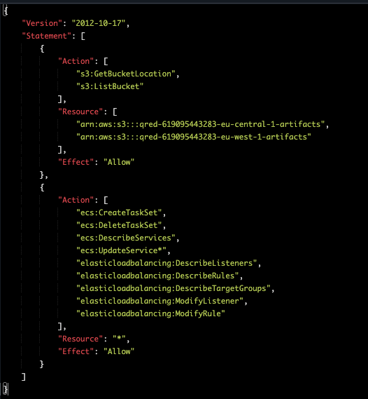

# Role inheritance POC

This is a cleaner and "better" (from a design standpoint) approach to creating roles.

Basically we have one base role that with basic permissions and the base `assumedBy` policy, and then roles extend (or inherit) that one, and add extra permissions on top of that.

This was deployed to test account and here's the end result of the permissions of the role:

